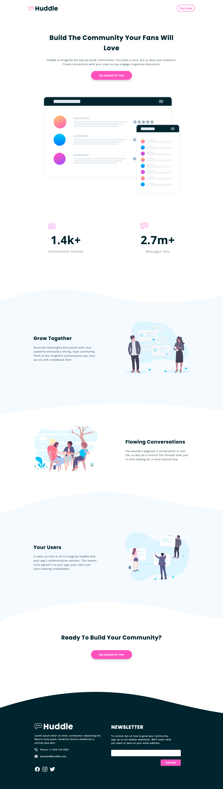

# Frontend Mentor - Huddle landing page with curved sections solution

This is a solution to the [Huddle landing page with curved sections challenge on Frontend Mentor](https://www.frontendmentor.io/challenges/huddle-landing-page-with-curved-sections-5ca5ecd01e82137ec91a50f2). Frontend Mentor challenges help you improve your coding skills by building realistic projects.

## Table of contents

- [Overview](#overview)
  - [The challenge](#the-challenge)
  - [Screenshot](#screenshot)
  - [Links](#links)
- [My process](#my-process)
  - [Built with](#built-with)
- [Author](#author)

## Overview

### The challenge

Users should be able to:

- View the optimal layout for the site depending on their device's screen size
- See hover states for all interactive elements on the page

### Screenshot

### Links

- [GitHub repo](https://github.com/darryncodes/huddle-landing-page-with-curved-sections)
- [Solution URL](https://darryncodes.github.io/huddle-landing-page-with-curved-sections/)
- [Live Site URL](https://www.darryncodes.co.uk/pages/huddle.html)

## My process

### Built with

- Semantic HTML5 markup
- SCSS
- JS
- Flexbox
- Mobile-first workflow
- BEM methodology

## Author

- Work in progress portfolio site - [@darryncodes](https://www.darryncodes.co.uk/)
- Frontend Mentor - [@darryncodes](https://www.frontendmentor.io/profile/darryncodes)
